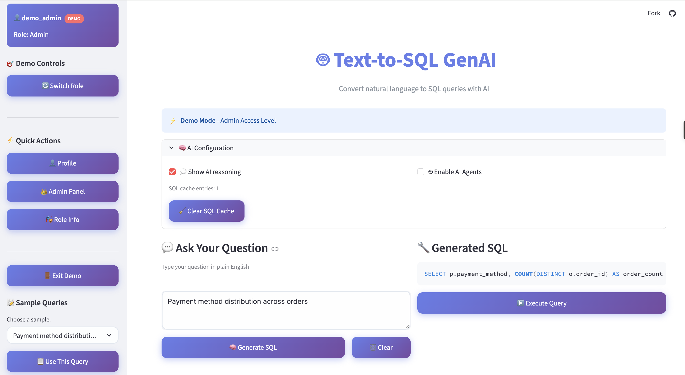
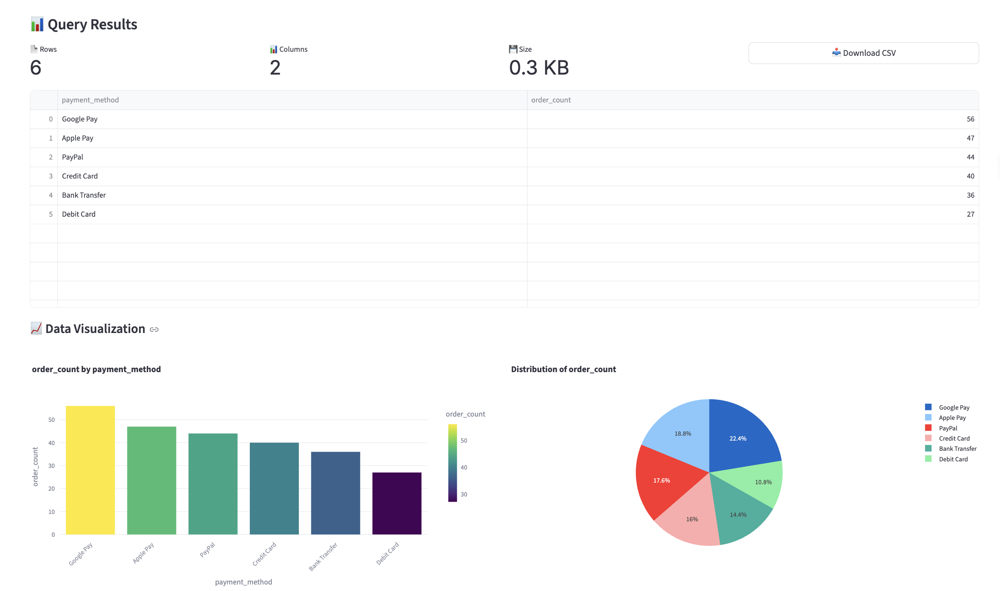

# 🤖 Text-to-SQL GenAI Application

A powerful web application that converts natural language queries into SQL statements using Google's Gemini AI, featuring multi-agent analysis and role-based authentication.

## 🌟 Live Demo

🔗 **[Try the Live App](https://text-to-sql-genai-app-8lt2fj7tclwh4tpmbyt5fj.streamlit.app/)**

Experience the application in action! The live demo includes:
- Sample e-commerce dataset with 1,693+ records
- All authentication roles (Guest/Viewer/Analyst/Admin)
- Real-time SQL generation and execution
- Interactive data visualizations

## 🖼️ App Screenshots

Save the two screenshots in `assets/screenshots/` with these names:

- `01-query-to-sql.png`
- `02-results-and-charts.png`

### Query to SQL Generation


### Results and Visualizations


## ✨ Key Features

- **🧠 AI-Powered SQL Generation**: Uses Google Gemini 2.5 Flash for natural language to SQL conversion
- **🤖 Multi-Agent System**: Planner, Validator, and Optimizer agents provide comprehensive query analysis
- **🔐 Role-Based Authentication**: Guest, Viewer, Analyst, and Admin access levels
- **📊 Rich Visualizations**: Auto-generated charts and data insights
- **⚡ Real-time Execution**: Instant SQL execution with performance metrics
- **💡 Chain-of-Thought Reasoning**: See how AI thinks through each query
- **📱 Modern UI**: Clean, responsive interface with advanced styling

## 🚀 Quick Start

### Prerequisites
- Python 3.8+
- Google Gemini API key

### One-Command Setup
```bash
./run.sh
```

### Manual Installation

1. **Clone the repository**
```bash
git clone https://github.com/yourusername/text-to-sql-app.git
cd text-to-sql-app
```

2. **Install dependencies**
```bash
pip install -r requirements.txt
```

3. **Set up environment variables**
```bash
cp .env.example .env
# Edit .env and add your GEMINI_API_KEY
```

4. **Initialize the database**
```bash
python scripts/create_sample_db.py
```

5. **Run the application**
```bash
streamlit run app.py
```

## 📁 Project Structure

```
text-to-sql-app/
├── app.py                 # Main Streamlit application
├── auth_system.py         # Authentication backend
├── auth_ui.py            # Authentication UI components
├── requirements.txt       # Python dependencies
├── run.sh                # One-command startup script
├── .env.example          # Environment variables template
├── .env                  # Environment variables (create from example)
├── README.md             # This file
├── DEVELOPMENT.md        # Quick development guide
├── .gitignore            # Git ignore file
├── database/
│   ├── sample.db         # Main SQLite database (1,693+ records)
│   ├── auth.db           # Authentication database
│   └── csv_data/         # Source CSV data files
└── scripts/
    └── create_sample_db.py # Database creation script
```

## 🗃️ Database Schema

The application uses a comprehensive e-commerce database with:

- **customers** (100 records) - Customer information
- **products** (150 records) - Product catalog
- **orders** (250 records) - Order records
- **order_items** (400 records) - Order line items
- **categories** (15 records) - Product categories
- **suppliers** (20 records) - Supplier information
- **reviews** (200 records) - Customer reviews
- **shipping_addresses** (120 records) - Delivery addresses
- **payments** (250 records) - Payment transactions
- **inventory** (150 records) - Stock levels
- **discounts** (20 records) - Promotional codes

## 🎭 User Roles

1. **👋 Guest** - Demo access, simple queries only
2. **👀 Viewer** - Read-only access, advanced querying
3. **📊 Analyst** - Data analysis with INSERT/UPDATE permissions
4. **⚡ Admin** - Full database access and user management

## 🤖 AI Agents

### 📋 Planner Agent
- Breaks down complex queries into manageable steps
- Identifies required tables and operations
- Assesses query complexity

### ✅ Validator Agent
- Validates if results make business sense
- Checks data accuracy and completeness
- Provides confidence scores

### ⚡ Optimizer Agent
- Suggests performance improvements
- Analyzes execution time and resource usage
- Recommends query optimizations

## 📊 Sample Queries

Try these example queries:

- "Show top 10 customers by total orders"
- "What are the most popular product categories?"
- "List all customers from USA with their email"
- "Show total revenue by month"
- "Which products are running low in inventory?"
- "Top 5 highest rated products"
- "Payment method distribution across orders"

## 🛡️ Security Features

- Role-based access control
- SQL injection prevention
- Query validation and sanitization
- Audit logging for all operations
- Session management

## 🔧 Configuration

### Environment Variables

Create a `.env` file with:

```env
GEMINI_API_KEY=your_gemini_api_key_here
DATABASE_URL=sqlite:///database/sample.db
```

### AI Configuration

- **Model**: Google Gemini 2.5 Flash
- **Chain-of-Thought**: Enabled by default
- **Multi-Agent System**: Can be toggled in UI
- **Reasoning Display**: Optional in settings

## 📈 Performance

- **Database**: 1,693+ records across 11 tables
- **Response Time**: < 2 seconds for most queries
- **AI Processing**: Chain-of-thought reasoning in ~3-5 seconds
- **Auto-visualization**: For datasets < 50 rows

## 🚀 Deployment

For production deployment:

1. Use PostgreSQL instead of SQLite for better performance
2. Set up proper environment variables securely
3. Configure authentication with real user management
4. Set up rate limiting for API calls
5. Use HTTPS for secure connections
6. Configure proper logging and monitoring

## 🤝 Contributing

1. Fork the repository
2. Create a feature branch (`git checkout -b feature/amazing-feature`)
3. Make your changes
4. Commit your changes (`git commit -m 'Add amazing feature'`)
5. Push to the branch (`git push origin feature/amazing-feature`)
6. Open a Pull Request

## 📄 License

This project is licensed under the MIT License.
